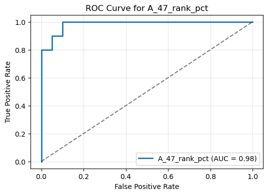

# methylation_biomarker

A small-scale Bio-ML experiment that builds a binary classifier on a biomarker to predict disease status. 

---

## Key Results

**ROC curve for logistic regression on a percentile rank**  
     
   *Figure 2.* Receiver-operating characteristic for a logistic regression using only the percentile-rank feature, achieving AUC = 0.985.
