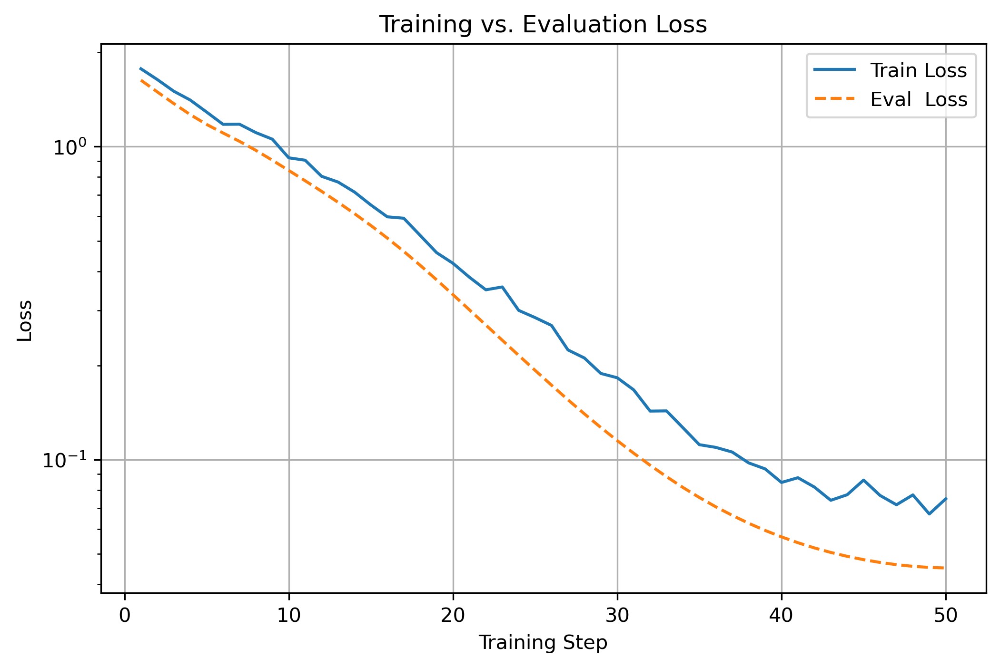
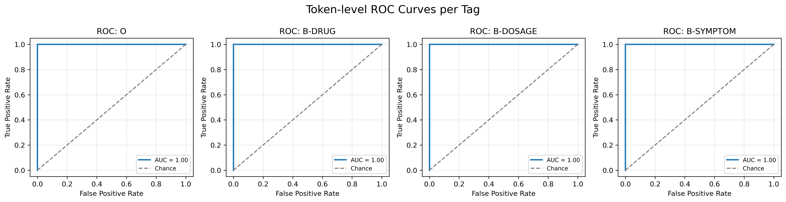

## Task 2: Named Entity Recognition (NER)

### Goal
Train a model that can extract these entities from a provided sentence. 
```
Sentence: "Patients were given 50mg of Aspirin and developed rash."
Entities:
- Drug Name: Aspirin
- Dosage: 50mg
- Symptom: rash
```

## Provided Datasets
- [`ner_data.csv`](data/ner_data.csv)
    - IOB-tagged format for NER (Token + Tag)

## Setup

1. **Create the Conda environment**  
   Use the provided `environment.yml` (or a preferred method) to install Python and all dependencies into an environment named `ner`:  
   ```bash
   conda env create -f environment.yml
   conda activate ner
   ```

    - Dependencies
    ```
    python=3.10 torch>=1.13.1 transformers>=4.30.0 datasets>=2.14.0 scikit-learn>=1.2.2 scipy>=1.10.1 matplotlib>=3.7.1 pandas>=2.0.2 evaluate>=0.4.0
    ```

2. **Verify the installation**
- `python -c "import torch; import transformers; import datasets; print(torch.__version__)"`
3. **Run the provided notebook**

## Notebook
[`notebooks/named_entity_recognition.ipynb`](notebooks/named_entity_recognition.ipynb)

## Approach
We first patch the original IOB file to label any “drug” tokens, group rows into sentences, and build a Hugging Face `Dataset` with integer‐encoded tags. Then we tokenize with `DistilBERT`—aligning subword outputs to our IOB labels—fine‐tune a `DistilBertForTokenClassification` model via the HF `Trainer`, and evaluate on held-out data (accuracy, F1, classification report). Finally, we plot training/validation loss and per-label ROC curves for complete end-to-end NER validation.

## Results
After only **one epoch** of fine-tuning, our DistilBERT token-classification model achieves perfect validation performance across all three entity types, and qualitative inspection of five sample predictions confirms that the extractions look correct.

```
First 5 validation predictions:

Sentence: "Patients experienced dizziness after administration of 50mg of DrugX"
Entities:
- Symptom: dizziness
- Dosage: 50mg
- Drug Name: DrugX

Sentence: "Patients experienced fever after taking 75mg of DrugE"
Entities:
- Symptom: fever
- Dosage: 75mg
- Drug Name: DrugE

Sentence: "Patients experienced vomiting post-treatment with 250mg of DrugA"
Entities:
- Symptom: vomiting
- Dosage: 250mg
- Drug Name: DrugA

Sentence: "Patients experienced headache post-treatment with 500mg of DrugZ"
Entities:
- Symptom: headache
- Dosage: 500mg
- Drug Name: DrugZ

Sentence: "Patients experienced rash after administration of 50mg of DrugX"
Entities:
- Symptom: rash
- Dosage: 50mg
- Drug Name: DrugX
```

| Label            | Precision | Recall | F1-Score | Support |
|------------------|-----------|--------|----------|--------:|
| O                | 1.00      | 1.00   | 1.00     |    1173 |
| B-DRUG           | 1.00      | 1.00   | 1.00     |     200 |
| B-DOSAGE         | 1.00      | 1.00   | 1.00     |     200 |
| B-SYMPTOM        | 1.00      | 1.00   | 1.00     |     224 |
| I-DRUG           | 1.00      | 1.00   | 1.00     |     200 |
| I-DOSAGE         | 1.00      | 1.00   | 1.00     |     200 |
| **Accuracy**     |           |        | **1.00** |    2197 |
| **Macro Avg**    | 1.00      | 1.00   | 1.00     |    2197 |
| **Weighted Avg** | 1.00      | 1.00   | 1.00     |    2197 |


### Training vs. Evaluation Loss  


### One-vs-Rest ROC Curves  


## LLM_DISCLOSURE

This project was developed with assistance from an LLM (OpenAI ChatGPT, model o4-mini), under full human supervision. The LLM was used for:

- **Brainstorming & design**: outlining the overall NER approach, data pipeline, and evaluation strategy.  
- **Concept clarification**: explaining IOB tagging, subword alignment, and model selection.  
- **Code generation**: providing templates for data loading, tokenization, label alignment, training loops, evaluation, and plotting.  
- **Debugging**: diagnosing errors in notebook cells and Python scripts and suggesting fixes.  
- **Refactoring & cleanup**: improving readability, structure, and consistency of code snippets.  
- **Documentation**: drafting the `README.md`, `environment.yml`, and usage instructions.  

All suggestions from the LLM were carefully reviewed, edited, and tested by the developer before inclusion.
