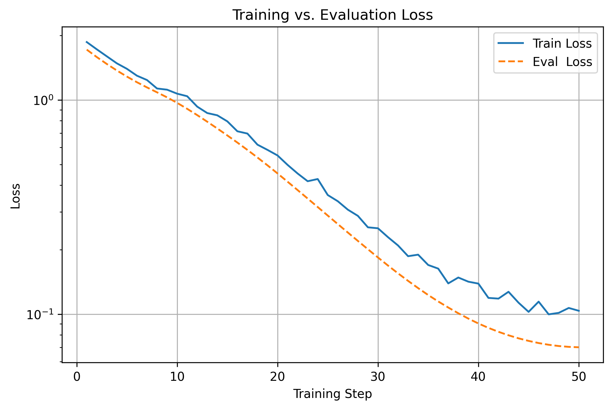
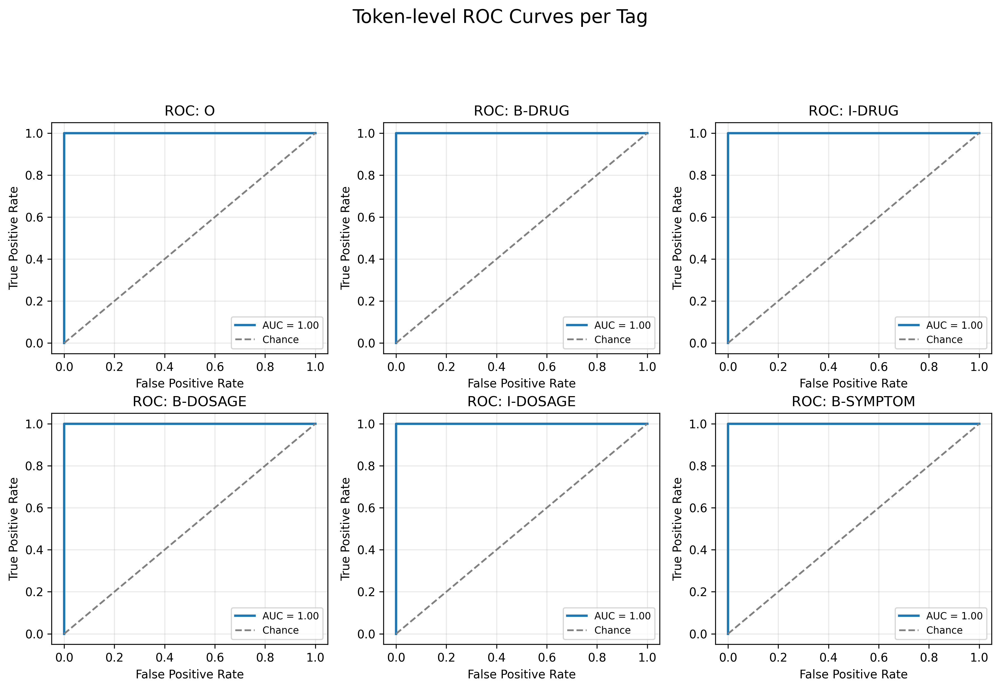

## Task 2: Named Entity Recognition (NER)

### Goal
Extract these entities:
- Drug Name (e.g., “Aspirin”)
- Symptom (e.g., “nausea”)
- Dosage (e.g., “50mg”)

### What to Do
- Load the provided ner_data.conll dataset (IOB format).
- Fine-tune a token classification model (e.g., DistilBERT), or use spaCy.
- Train on token-level annotations.
- Evaluate using entity-level precision, recall, and F1 score.

### Example
```
Sentence: "Patients were given 50mg of Aspirin and developed rash."
Predicted Entities:
- Drug Name: Aspirin
- Dosage: 50mg
- Symptom: rash
```

## Provided Datasets
- [`ner_data.cdv`](data/ner_data.csv)
    - IOB-tagged format for NER (Token + Tag)
    
## Notebook
[`notebooks/named_entity_recognition.ipynb`](notebooks/named_entity_recognition.ipynb)

## Results

After just **one epoch** of fine-tuning, our DistilBERT token-classification model achieves perfect performance on the validation set across all three entity types.

### Training vs. Evaluation Loss  


### One-vs-Rest ROC Curves  
