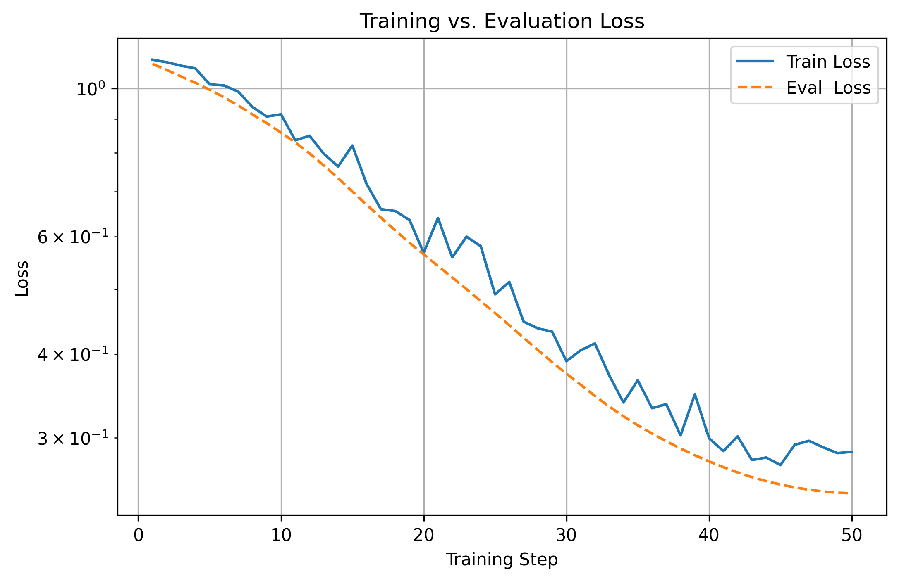
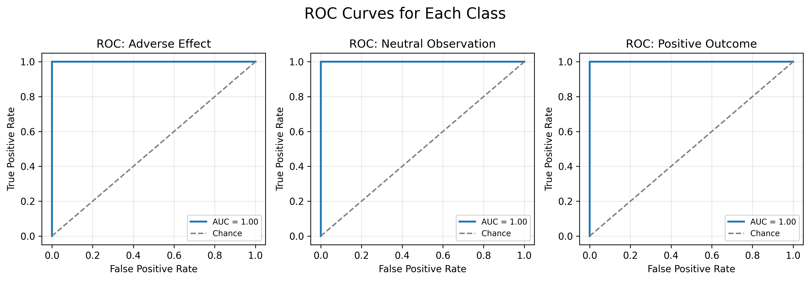

## Task 1: Sentence Classification

### Goal
Classify sentences into:
- Adverse Effect
- Positive Outcome
- Neutral Observation

### Example
```
Sentence: "Patient reported mild headache after taking DrugA."
Predicted Category: Adverse Effect
```

## Provided Datasets
- [`classification_data.csv`](./data/classification_data.csv)
    - Columns: `id`, `text`, `label`

## Setup

1. **Create the Conda environment**  
   Use the provided `environment.yml` (or a preferred method) to install Python and all dependencies into an environment named `sentence_class`:  
   ```bash
   conda env create -f environment.yml
   conda activate sentence_class
   ```

    - Dependencies
    ```
    python=3.10 python=3.10 numpy pandas>=2.0.2 pytorch>=1.13.1 torchvision torchaudio transformers>=4.30.0 datasets>=2.14.0 scikit-learn>=1.2.2 scipy>=1.10.1 matplotlib>=3.7.1 evaluate>=0.4.0
    ```

2. **Verify the installation**
- `python -c "import torch; import transformers; import datasets; print(torch.__version__)"`
3. **Run the provided notebook**

## Notebook
[`notebooks/classification_data.ipynb`](notebooks/classification_data.ipynb)

## Approach
This notebook fine-tunes `DistilBERT` for text classification by: loading and encoding labels, splitting into train/val sets, tokenizing with `DistilBertTokenizerFast`, wrapping data in PyTorch datasets, initializing `DistilBertForSequenceClassification`, setting training hyperparameters via `TrainingArguments`, and using the Hugging Face `Trainer` to train for one epoch and evaluate on the validation split.

## Results
After just one epoch of fine-tuning, the pretrained `DistilBERT` model achieves perfect validation performance (Accuracy = F1 = AUC = 1.0) for all 3 classes.

```
First 5 validation predictions:

Example 1
  Text       : Mild headaches were reported after the second dose of DrugY.
  True label : Adverse Effect
  Pred label : Adverse Effect

Example 2
  Text       : Severe allergic reactions were observed following DrugB administration.
  True label : Adverse Effect
  Pred label : Adverse Effect

Example 3
  Text       : Patients were instructed to maintain a food diary.
  True label : Neutral Observation
  Pred label : Neutral Observation

Example 4
  Text       : DrugZ caused severe rashes in some participants.
  True label : Adverse Effect
  Pred label : Adverse Effect

Example 5
  Text       : The treatment resulted in full remission for the majority of patients.
  True label : Positive Outcome
  Pred label : Positive Outcome
```

### Training vs. Evaluation Loss  


### One-vs-Rest ROC Curves  


## LLM_DISCLOSURE

Development of this sentence classification notebook was assisted by an LLM (OpenAI ChatGPT, model o4-mini), under full human supervision. Specifically, the LLM contributed to:

- **High-level design**: defining the classification task, selecting metrics (accuracy, F1, AUC), and outlining the data pipeline.  
- **Concept explanations**: clarifying label encoding, train/validation splitting, and evaluation strategies.  
- **Code scaffolding**: generating boilerplate for data loading, tokenization, PyTorch dataset wrappers, model instantiation, and Trainer setup.  
- **Debugging support**: identifying and fixing errors in notebook cells (e.g., shape mismatches, missing imports).  
- **Refactoring & style**: improving code readability, organizing imports, and unifying naming conventions.  
- **Documentation**: drafting setup instructions, README sections, example outputs, and `environment.yml` snippets.  

All AI-generated suggestions were reviewed, refined, and tested by the developer before being merged into the final code base.