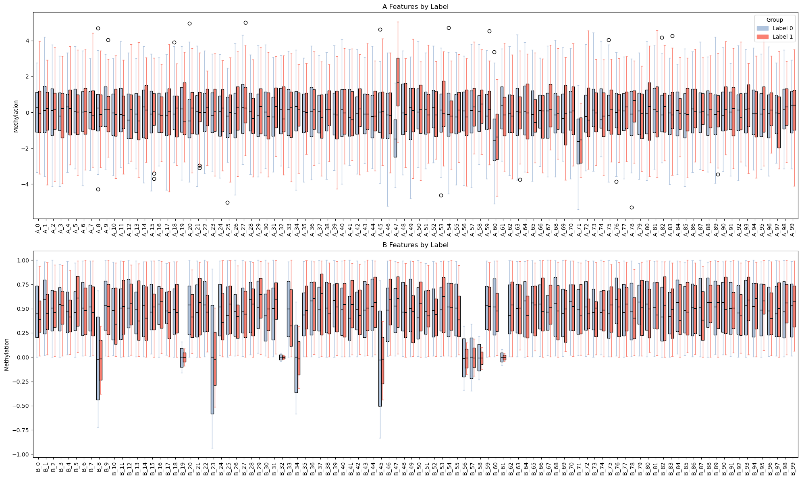
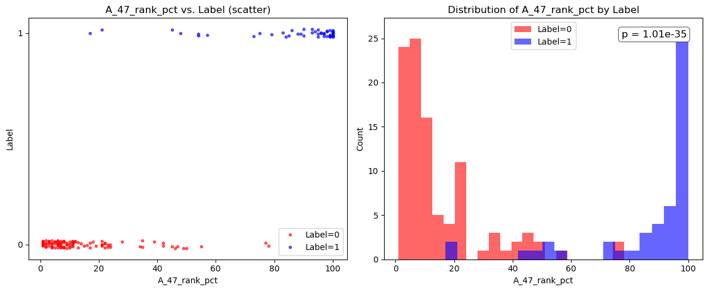
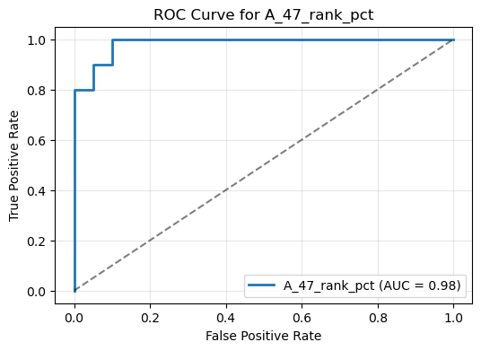

# methylation_biomarker

A small-scale bio-ML experiment that builds a binary classifier on DNA methylation profiles to predict disease status. 

---

## Key Results

1. **Global feature distributions**  
     
   *Figure 1.* Boxplots showing the range and variability of each methylation feature across the entire cohort.

2. **A_47 percentile-rank vs. label**  
     
   *Figure 2.* The within-sample percentile rank of feature **A_47** separates Label 0 and Label 1 with extreme significance (p ≈ 1 × 10⁻³⁵).

3. **ROC curve for logistic regression on A_47 rank**  
     
   *Figure 3.* Receiver-operating characteristic for a logistic regression using only the A_47 percentile-rank feature, achieving AUC = 0.985.
